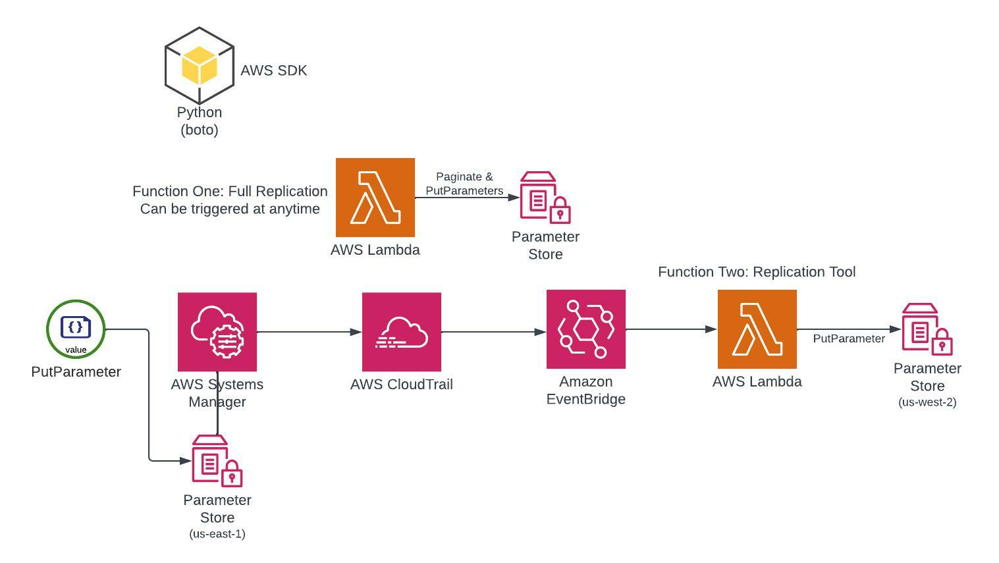

# aws-ssm-cross-region-replication
Any AWS solutions architect will has likely encountered this problem at one time or another; cross-region replication of
AWS SSM Parameters. This is a python project with two solutions for cross-region replication of SSM Parameters. The 
first solution is for copying existing SSM Parameters from a source region to a target region. The second solution takes
a "PutParameter" event from CloudTrail, and copy's the new/modified SSM to a target region. The latter solution is 
intended only to be used as a Lambda since using CloudTrail and EventBridge are leveraged here for invocation.

## Requirements:
- Python3 installed (I used Python3.8)
- boto3 installed
- Access to multiple regions within AWS accounts

## Architecture:


## Usage:

### CloudFormation
1. Zip up the lambda python files independently of one another and upload to an S3 bucket of your choosing.
2. Deploy the CloudFormation template as provided and fill out the parameters specific to your needs.
3. The continuous replication lambda should begin to function as SSMs are created/updated/deleted.
4. The initial replication lambda is invoked via an empty "Test event". CAUTION: IT WORKS!

### initial_replicate_ssm_parameters.py
This initial replication script handles cross-region replication only. This is intended to be used as an AWS lambda with
an environment variable of 'targetRegion' Invocation/execution can be done by configuring a test event '{}' or 
integrated with EventBridge to be executed as a scheduled action.

### continuous_replicate_ssm_parameters.py
A cross-region replication script to replicate any newly created or updated SSM parameters in real-time. After the 
initial replication using the `initial_replicate_ssm_parameters.py` this script is designed to handle all future CUD 
operations in SSM parameter store. It is designed to be used as a lambda, with an EventBridge rule based on the 
triggering of CloudTrail events: PutParameter, DeleteParameter, DeleteParameters. Whichever action is executed, will be 
replicated to the desired region set in the environment variable 'targetRegion'.

## BONUS: Cross Account Replication
### cross_account_replicate_ssm_parameters.py
First log into both aws accounts with `aws sso login`. Then substitute out the parameters for actual values.
<aws profile name of the source account> = profile1
<aws profile name of the target account> = profile2 (same account replication is available)
<aws region name of the source region> = region1
<aws region name of the target region> = region2
<path of the SSMs to recursively copy (use '/' for all)> = /path
```
python3 ./local/cross_account_replicate_ssm_parameters.py -sp <aws profile name of the source account> -tp <aws profile name of the target account> -sr <aws region name of the source region> -tr <aws region name of the target region> -p <path of the SSMs to recursively copy (use '/' for all)>
```

## NOTE/WARNING:
The replication functions overwrite destination SSMs with identical names. This would require your SSMs to have globally
unique names/convention, which I personally feel like is a best practice anyway ¯\_(ツ)_/¯
